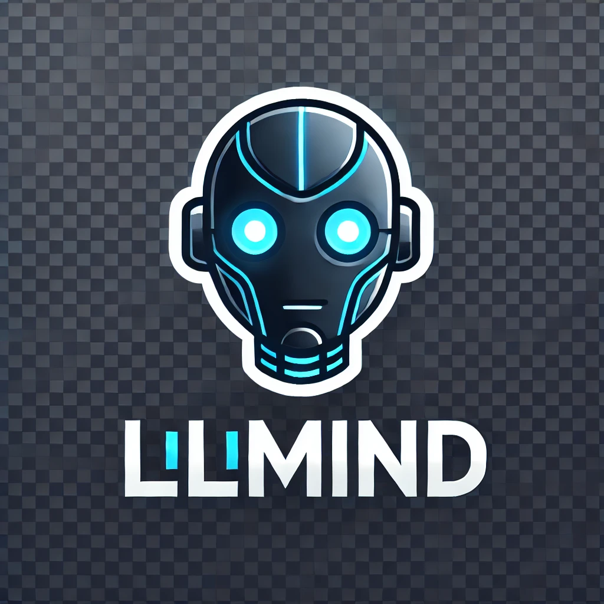

<p align="center">
  
</p>

# 💬 LLMind


**LLMind** is a personalized AI chatbot built from scratch using **transfer learning**, **LLMs**, and modern **full-stack technologies**.  
Unlike typical bots that rely on external APIs, LLMind features a **self-trained** lightweight language model fine-tuned for conversational behavior and served through a custom backend.

> 🚀 This project is part of a long-term AI roadmap focused on learning, building, and deploying intelligent assistants.

---

## 🔧 Tech Stack

| Layer        | Tools |
|--------------|-------|
| Model        | Python, PyTorch, Hugging Face Transformers |
| Training     | Google Colab |
| Backend      | Django, Django REST Framework *(coming soon)* |
| Frontend     | HTML, CSS, JavaScript *(coming soon)* |
| Dev Tools    | GitHub Codespaces |
| Deployment   | Gradio (v1.0), Render, Hugging Face Spaces, Netlify *(future)* |

---

## 📁 Folder Structure

```plaintext
LLMind/
├── training/       # Model fine-tuning scripts (Colab)
├── inference/      # Chatbot logic and response generation
├── model/          # Saved model & tokenizer (except .bin)
├── backend/        # Django API (coming soon)
├── frontend/       # Chat UI (coming soon)
├── utils/           # Custom training data
├── gradio_app/     # Gradio app script
└── README.md       # You're reading it
```
---

## 🚀 Usage (Quick Start with Gradio)

1. **Clone the repo**
2. **Install dependencies**
    ```bash
    pip install transformers gradio torch
    ```

3. **Run the chatbot**
    ```bash
    cd gradio_app
    python app.py
    ```

---

## 🧭 Roadmap

- ✅ Build LLM with transfer learning  
- ✅ Gradio prototype (v1.0)  
- 🔄 Refine personality & memory features  
- 🌐 Build full backend with Django REST API  
- 🎨 Build web UI (HTML/CSS/JS)  
- ☁️ Deploy full version to production  
- 🤝 Connect multiple AIs for reasoning chains  

---

## 🙌 Author

Made with 💻, 🧠, and 🚀 by **Aryan**  
*Always learning. Always building. Always leveling up.*

---

## 📄 License

Licensed under the [Apache 2.0 License](LICENSE).
